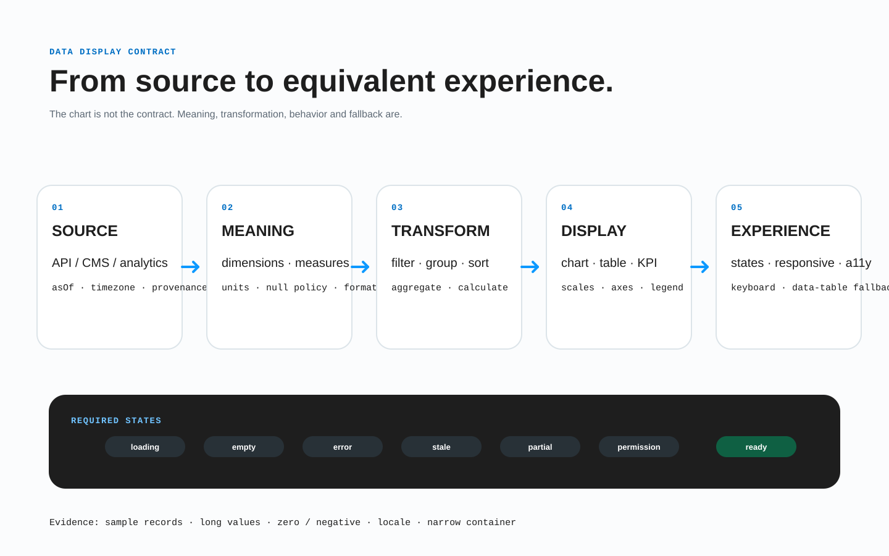

# Data and visualization contract

BRIDGE treats data display as a product contract, not as sample copy arranged in rectangles. A transferable design states what the data means, where it comes from, how it is formatted, which operations users can perform, and what happens when the ideal dataset is unavailable.



*One semantic dataset may have several declared presentations. Formatting and responsive composition must not change its meaning.*

## What belongs in the contract

For each table, grid, metric, list, or chart, record:

| Concern | Required decision |
| --- | --- |
| Purpose | The question the display answers and the decision it supports. |
| Schema | Field keys, value types, nullable values, identifiers, and relationships. |
| Cardinality | Minimum, typical, maximum, pagination/windowing, and whether the total is known. |
| Provenance | Source system or owner, aggregation method, refresh time, and freshness/staleness rule. |
| Presentation | Column/series meaning, order, grouping, sorting, filtering, comparison baseline, and precision. |
| Format | Locale, time zone, currency, units, sign, rounding, missing-value marker, and date/number notation. |
| States | Loading, empty, error, partial, stale, offline, and unauthorized behavior. |
| Responsive | Same-tree behavior or a declared transformation with semantic parity. |
| Accessibility | Name, description, headers/relationships, keyboard operation, and a non-visual equivalent. |
| Trust | Data limitations, estimates, sample size, privacy/suppression rules, and last-updated information. |

Sample values in Figma are fixtures. They are not the schema, maximum length, precision rule, or runtime source of truth.

## Roles: content, data display, and controls

- **Content** is authored product copy: a title, explanation, footnote, or annotation.
- **Runtime data** is supplied by a service, CMS, calculation, sensor, or user input.
- **Data display** maps runtime data to a table, grid, metric, list, map, or chart.
- **Controls** change the query or presentation: filter, sort, date range, pagination, drill-down, or series visibility.
- **Provenance** tells users and implementers why a value can be trusted and how current it is.

Keep these roles distinct. A chart title is not a data field; a highlighted maximum is not a new value; a filter chip is not part of the result collection.

## Use short layer tags, keep the rich contract structured

Layer names and existing BRIDGE tags should expose only the anchors a reviewer needs in the design:

```text
revenue [section=revenue-overview]
  period-filter
  revenue-chart
  revenue-table
  data-status
```

Do not encode the entire schema in names such as `[series-revenue]`, `[currency-usd]`, `[timezone-utc]`, and dozens of similar tags. Attach or export one structured contract keyed by `revenue-chart`:

> **Non-standalone module fragment.** This excerpt shows only `bridge.data` and intentionally omits required envelope fields. Insert it into the required `bridge` envelope from the [transfer contract](04-transfer-contract.md#required-envelope) before exchange or full-contract validation.

```json
{
  "bridge": {
    "data": {
      "displays": [{
        "displayId": "revenue-chart",
        "purpose": "Compare recognized revenue with target by month",
        "source": { "owner": "finance-analytics", "dataset": "recognized-revenue", "refresh": "daily", "staleAfter": "PT36H" },
        "dimensions": [{ "key": "month", "type": "year-month", "timeZone": "UTC" }],
        "measures": [
          { "key": "actual", "type": "decimal", "currency": "USD", "aggregation": "sum" },
          { "key": "target", "type": "decimal", "currency": "USD", "aggregation": "sum" }
        ],
        "format": { "locale": "user", "notation": "compact", "maximumFractionDigits": 1 },
        "states": ["loading", "empty", "error", "partial", "stale"],
        "accessibleEquivalent": "revenue-table"
      }]
    }
  }
}
```

Structured metadata is versionable, reviewable, and target-independent. It may live in Figma plugin data, a sidecar file, or an adapter payload, but it must reference stable BRIDGE identities and travel with the handoff.

## Tables

A data table contract declares:

- caption or accessible name and, when useful, a short summary;
- row identity and column keys;
- header scope, grouped headers, and relationships between header and data cells;
- default sort and whether sorting is client- or server-side;
- filter semantics, active-filter announcement, and reset behavior;
- pagination, infinite loading, or virtualization, including total-count behavior;
- selection model, bulk-action scope, and persistence across pages;
- editable-cell validation and save/revert behavior;
- overflow behavior at narrow widths without hiding essential fields silently.

Use a semantic table when users compare values across rows and columns. A visual card layout is not a reason to discard the relationships. Follow the [WAI tables tutorial](https://www.w3.org/WAI/tutorials/tables/) for header association patterns.

## Grids, lists, and repeated cards

Declare the item schema independently of how many fixtures fit a Figma frame. Specify stable item identity, ordering, grouping, minimum/maximum/unknown counts, pagination, duplicates, missing media, and long or localized values.

A responsive column change does not change cardinality:

```text
product-grid
  product-card-oak-chair
  product-card-wool-lamp
  product-card-steel-desk
  product-card-cork-stool
```

These are stable **design fixture instance** keys, not array positions and not runtime database ids. A repeated data item has separate identities: `templateKey` for the reusable card, `designInstanceKey` for the authored fixture, and `runtimeDataKey` (or another product record key) for reconciliation after sorting, filtering, pagination, and live updates. The structured mapping—not a `-1`, `-2` layer suffix—defines the relationship. Never expose a confidential backend identifier merely to satisfy the contract.

If mobile deliberately loads a different window of records, the query/pagination contract must say so. Do not delete fixture cards merely to produce a full final row.

## Charts and maps

Every chart contract states:

1. the analytical question and suitable chart form;
2. dimensions, measures, units, domains, aggregation, baseline, and ordering;
3. the complete scale behavior, including zero baseline when required and treatment of outliers;
4. the meaning of color, shape, line style, size, and annotation;
5. hover, focus, selection, zoom, pan, drill-down, and reset behavior;
6. tooltip content and formatting;
7. an accessible name and concise summary of the principal pattern;
8. access to the values through a data table, list, or downloadable equivalent.

Never communicate a series or status by color alone. Ensure labels and marks meet applicable contrast requirements, keep tooltips reachable by keyboard and pointer, and do not make a canvas/SVG picture the only representation of the information. The [WAI images tutorial on complex images](https://www.w3.org/WAI/tutorials/images/complex/) describes text alternatives for charts and diagrams.

## Formats are semantics

Declare locale-sensitive formatting rather than copying visible punctuation:

- a currency value includes currency and currency-display policy;
- a percentage distinguishes `0.25` from `25`;
- a measurement includes the unit and conversion/rounding policy;
- a timestamp includes source zone, display zone, daylight-saving behavior, and granularity;
- a range defines inclusivity and start/end semantics;
- missing, zero, suppressed, estimated, and not-applicable values use different states when they mean different things.

Do not let compact notation, rounding, or truncation make totals contradictory. Full precision should remain available where users need it.

## Required data states

| State | Contract question |
| --- | --- |
| Loading | Is previous data retained? Is progress determinate? What is announced? |
| Empty | Is the query valid but has no results? What recovery action exists? |
| Error | Which operation failed, what remains usable, and can it be retried? |
| Partial | Which subset is missing, and may the user act on incomplete results? |
| Stale | How old is it, why is it shown, and how is refresh requested? |
| Offline | What is cached, what action is queued, and how is reconnection reported? |
| Unauthorized | Is content hidden, redacted, or replaced by a permission request? |

Skeletons must resemble eventual structure without pretending to be real content. A live update must preserve focus and selection and be announced only when it materially affects the user.

## Responsive data transformations

Same logical tree is the default. Tables may scroll, columns may resize, charts may reflow, legends may move, and labels may wrap without a structural exception.

When the usable presentation truly changes—table to cards, multi-series chart to small multiples, or inline details to disclosure—declare a responsive transformation. It must record:

- source and resulting identities;
- container or viewport condition;
- field/series mapping with no silent loss of meaning;
- reading, focus, and action order;
- location of omitted details and how users reach them;
- state, selection, filter, and URL/history preservation;
- accessible equivalent in every presentation.

A smaller screen is not permission to remove comparison fields, provenance, or recovery actions. See [Responsive breakpoints](03-responsive-breakpoints.md).

## Data review gate

A data display is ready only when reviewers can answer:

- Can we implement it with zero invented fields or formats?
- Do fixtures cover zero, one, typical, maximum, long, missing, stale, partial, and failed data?
- Are source, refresh, units, precision, and time zone explicit?
- Do sorting, filtering, pagination, selection, and drill-down have complete reactions and states?
- Does the narrow presentation preserve meaning and task completion?
- Can a keyboard or screen-reader user obtain the same values and conclusions?
- Are privacy, suppression, estimates, and limitations visible where needed?
