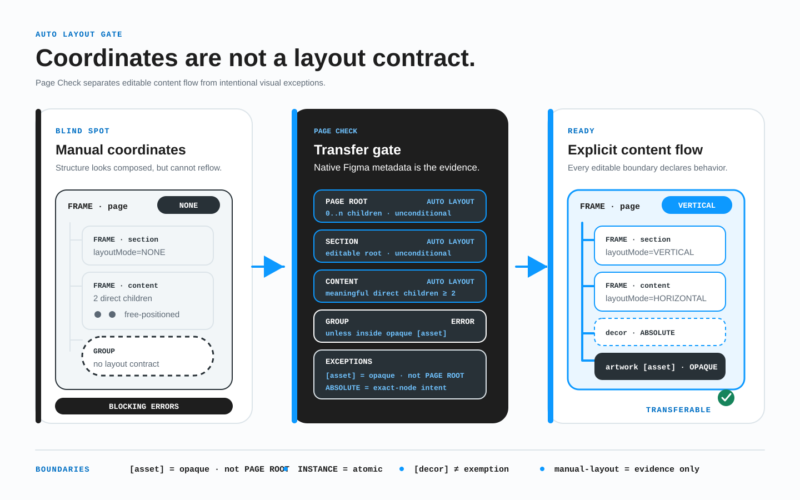

# Правила подготовки макета

Макет, подготовленный по BRIDGE, должен быть понятен до начала реализации. В Figma это достигается не набором технических тегов, а правильно собранной структурой, стабильными именами и явно описанным продуктовым смыслом.

## 1. Не дублируйте данные Figma

Не записывайте в названии слоя технические свойства, которые Figma уже предоставляет как данные:

- тип слоя: текст, изображение, вектор или экземпляр компонента;
- направление, интервалы, внутренние отступы, выравнивание и перенос в Auto Layout;
- иерархию фреймов, групп и компонентов;
- позиционирование, ограничения, обрезку и размеры;
- заливки, обводки, эффекты и маски;
- исходный компонент, варианты и свойства компонента.

Эти данные получает адаптер. Ручной тег нужен только там, где Figma не знает продуктовый смысл.

## 2. Добавляйте только недостающий смысл

В названии слоя можно объявить:

- страницу, рабочий маршрут, контрольную ширину и состояние страницы;
- секционный ключ;
- `href` известной ссылки или черновую отметку `[link]`;
- `action` известного действия или черновую отметку `[control]`;
- идентификатор поля формы;
- цель модального окна или состояния;
- декоративное назначение слоя;
- необходимость экспортировать сложный визуал целиком;
- намеренную фиксированную высоту, правила обработки переполнения или исключение.

## 3. Собирайте структуру с нативной раскладкой

Связанные элементы должны образовывать настоящую иерархию, а их поток должен быть задан явно:

- текст и связанные кнопки находятся в осмысленном родителе;
- карточки входят в общий список или сетку;
- заголовок, описание и действия секции находятся внутри секции;
- повторяющиеся элементы устроены одинаково;
- технические имена вроде `Frame 53`, `Group 271` и `copy 2` не остаются частью готовой структуры.

Если элементы должны адаптироваться вместе, они не должны оставаться случайно расположенными соседями. Фрейм, который лишь сохраняет нарисованные вручную координаты, не является переносимым контрактом раскладки.

### Блокирующая политика нативной раскладки



*Gate проверяет структуру: нативный поток проходит, а ручные контейнеры и GROUP вне непрозрачного ресурса остаются блокирующими ошибками.*

Используйте нативный Auto Layout Figma — вертикальный, горизонтальный или сеточный — на следующих границах:

| Узел источника | Обязательная политика |
| --- | --- |
| Корень страницы BRIDGE | Всегда использует Auto Layout, даже при нуле или одном дочернем слое. Корень страницы нельзя пометить `[asset]` ради обхода правила. |
| Секция страницы, собранная фреймом | Всегда использует Auto Layout, даже при нуле или одном дочернем слое. Секция может быть непрозрачным `[asset]` только тогда, когда целиком передаётся одним визуалом и не содержит живого текста, элементов управления, форм, данных или контентного потока. |
| Обычный контейнер содержимого с поддержкой Auto Layout | Использует Auto Layout при наличии не менее двух видимых значимых прямых дочерних элементов в потоке содержимого. |
| Примитив или конечная геометрия | Исключены, потому что не владеют потоком содержимого. |
| Непрозрачное поддерево `[asset]` | Внутренняя композиция исключена из проверки. Корень ресурса всё равно участвует как один дочерний элемент в Auto Layout родителя. |
| Экземпляр компонента | Page Check считает размещённый экземпляр атомарной границей, не переходит к исходному компоненту и не анализирует его. Редактируемый исходный корень проверяется отдельно по этой политике. |

**Значимый дочерний элемент потока** — видимый прямой потомок с содержимым, взаимодействием, смысловой структурой или переиспользуемым визуальным элементом. Скрытые и архивные слои, а также правильно объявленные абсолютные визуальные элементы не создают обычный поток контейнера. Для корней страниц и секций порог в два элемента не применяется: Auto Layout обязателен безусловно.

### Группа не является контейнером раскладки

Узел `GROUP` Figma вне поддерева `[asset]` является блокирующей ошибкой независимо от числа потомков. Замените его фреймом или компонентом и задайте нативный Auto Layout. `[decor]` не делает GROUP допустимым и не может использоваться для обхода структурных правил.

Если преобразование действительно невозможно, запишите предлагаемое отклонение на самой группе:

```text
legacy-lockup [bridge-exception=manual-layout] [reason=vendor-master-art]
```

Оба тега должны стоять на точном узле GROUP. Они документируют неизбежную ручную композицию, но **не подавляют** `layout.group-outside-asset`: Page Check всё равно показывает блокирующую ошибку. Отдельный gate принятия отклонения должен проверить область, влияние, смягчение, свидетельства, владельца, согласующего и дату пересмотра. Исключение также не освобождает родительскую страницу, секцию или контейнер потока от Auto Layout.

### Абсолютные визуальные слои

Намеренный абсолютный декор может быть конечным визуальным слоем:

```text
hero-glow [decor]
```

`[decor]` допустим только на точном визуальном слое с абсолютным позиционированием Figma. Он не разрешает произвольное свободное поддерево и не отменяет правила Auto Layout или GROUP для предков. Сложную декоративную композицию, которую нужно считать непрозрачной, помечайте `[decor] [asset]`; для намеренного недекоративного наложения, которое нельзя выразить иначе, используйте `[bridge-exception=overlay] [reason=...]` на точном узле наложения.

```text
Главная [page=home] [bp=1440] [view=default]  // FRAME, вертикальный Auto Layout
  hero [section=hero]                          // FRAME, вертикальный Auto Layout
    hero-copy                                  // FRAME, вертикальный Auto Layout
      hero-title                               // конечный TEXT
      hero-subtitle                            // конечный TEXT
    hero-glow [decor]                          // намеренный абсолютный визуальный слой
    hero-art [decor] [asset]                   // намеренный абсолютный непрозрачный визуал
```

## 4. Различайте контент, декор и экспорт

**Контентное изображение** несёт смысл. Если его убрать, пользователь потеряет информацию. Такое изображение получает стабильное имя слоя.

**Декоративный слой** отвечает только за оформление. Он помечается `[decor]`:

- не считается продуктовым содержимым;
- вне поддерева `[asset]` является точным намеренным абсолютным визуальным слоем, а не контейнером потока или свободной группой GROUP;
- не должен попадать в дерево доступности;
- не требует альтернативного текста;
- всё равно сохраняет стабильное имя и не исчезает между адаптивами без объяснения;
- никогда не освобождает страницу, секцию, контейнер, GROUP или произвольное поддерево от структурной политики выше.

**Экспортируемый ресурс** — сложный визуал, который нужно использовать целиком, а не собирать заново из внутренних слоёв. Он помечается `[asset]` и также сохраняет стабильное имя. Внутренняя свободная композиция ресурса считается непрозрачной для структурной проверки, но его корень остаётся одним элементом Auto Layout родителя. Нельзя пометить `[asset]` весь корень страницы BRIDGE только ради подавления ошибок раскладки.

```text
product-photo
snow-bg [decor]
hero-glow [decor]
promo-poster [asset]
lab-illustration [asset]
sneg [decor] [asset]
```

Формы со значением остаются запасным вариантом для плохо названных слоёв:

```text
Frame 182 [decor=snow-bg]
Group 91 [asset=promo-poster]
```

## 5. Корневой фрейм описывает один адаптив

Корневой фрейм должен однозначно указывать страницу, состояние и контрольную ширину. `[route=...]` добавляется только тогда, когда известен настоящий рабочий маршрут:

```text
Главная [page=home] [route=/] [bp=1920] [view=default]
Главная [page=home] [route=/] [bp=375] [view=default]
```

Если маршрут неизвестен, не придумывайте временный рабочий адрес:

```text
Контакты [page=contacts] [bp=1440] [view=default]
```

Адаптив — это та же страница для другой ширины, а не новая версия её смысла.

## 6. Обработка переполнения — это решение

Если карточка, маска или другая ограниченная поверхность может обрезать содержимое, ожидаемое поведение должно быть задано намеренно.

Текст из CMS, каталога, административной панели или файла локализации не должен зависеть от ручных переносов строк. Он переносится по ширине контейнера и имеет понятное поведение при нехватке места.

## 7. Редактируемые элементы остаются редактируемыми

Не превращайте текст, кнопки, поля формы, простые фигуры и иконки в изображения без причины. `[asset]` нужен для сложного визуала, который целевая реализация не должна или не может воспроизводить из отдельных слоёв.

## 8. Методология не зависит от платформы

BRIDGE не привязан к конкретному инструменту. Figma является основным источником макета, но тот же контракт можно перенести во фреймворк, статический HTML/CSS, мобильный интерфейс, визуальный редактор или внутреннюю дизайн-систему.
