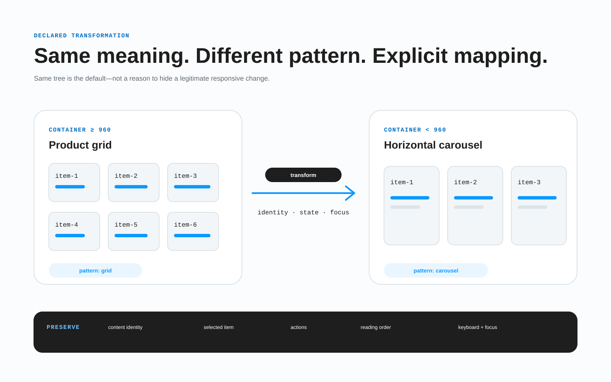

# Адаптивное поведение и контрольные ширины

BRIDGE передаёт адаптивность как набор объявленных контекстов и правил, а не как независимые изображения desktop и mobile.



*По умолчанию сохраняется одно логическое дерево. Другая композиция допустима только через преобразование, сохраняющее смысл и выполнение задачи.*

## Подготовленные корневые фреймы

Создайте корни для репрезентативных контекстов. Они могут быть соседями на странице Figma или находиться внутри нативных Section Figma:

```text
Главная [page=home] [route=/] [bp=1440] [view=default]
Главная [page=home] [route=/] [bp=768] [view=default]
Главная [page=home] [route=/] [bp=375] [view=default]
```

```text
Страница Figma
├─ Адаптивы desktop                             // нативная Section Figma, только организатор
│  ├─ Главная [page=home] [bp=1440] [view=default]
│  └─ Главная [page=home] [bp=768] [view=default]
└─ Главная [page=home] [bp=375] [view=default]  // прямой корень тоже допустим
```

Page Check проходит сквозь нативные Section Figma при поиске корней, а затем сравнивает размеченные корневые фреймы. Имя, порядок и вложенность организаторов не считаются продуктовой структурой. Обычный внешний `FRAME` или `GROUP` не заменяет корень и не является прозрачным для поиска.

`[bp]` фиксирует ширину подготовленного фрейма. Это свидетельство и точка сравнения, но не автоматическая граница media query. Не добавляйте ширину и устройство в дочерние идентификаторы.

Каждый подготовленный корень страницы использует нативный Auto Layout на каждом адаптиве. Секции-фреймы также используют Auto Layout, как и обычные контейнеры с не менее чем двумя видимыми значимыми элементами потока. Между адаптивами могут меняться направление Auto Layout, перенос, интервалы и размеры, но не допустимость `layoutMode=NONE` или GROUP Figma вне ресурса.

## По умолчанию одно логическое дерево

В рамках одной страницы, состояния, локали, темы, эксперимента, роли и сценария данных корни сохраняют:

- важные логические элементы и стабильные идентификаторы;
- смысловые связи родителей и потомков;
- смысл содержимого и рабочих данных;
- действия, цели, имена полей и результаты состояний;
- схему и правила количества коллекции, а не число элементов в строке;
- доступные названия, связи, порядок чтения и выполнение задачи;
- назначение контента, декора и экспортируемых ресурсов.

Без структурного преобразования можно менять:

- размеры, интервалы, выравнивание и ограничения;
- направление Auto Layout/flex/grid и число колонок;
- кегль внутри типографического контракта и естественные переносы;
- визуальный порядок соседей одного смыслового родителя при правильном чтении и фокусе;
- объявленную видимость дополнительного представления без замены другим идентификатором;
- закрепление, переполнение и геометрию по заданным правилам.

«Одно дерево» означает те же логические и семантические сущности, а не обязательные скрытые дубликаты в DOM. Скрытый элемент может отсутствовать в отрисованном дереве и дереве доступности, пока его идентификатор и правило видимости прослеживаются в контракте.

## Не меняйте количество данных ради адаптива

Сетка из четырёх или двух колонок остаётся одной коллекцией. Не удаляйте примеры ради полной последней строки:

```text
product-grid
  product-card-oak-chair
  product-card-wool-lamp
  product-card-steel-desk
  product-card-cork-stool
```

Это идентификаторы примеров макета, а не позиции массива. Рабочая запись связывается стабильным продуктовым ключом. Другое окно записей требует правила пагинации, запроса или сценария данных.

## Область просмотра и контейнер

Для каждого правила объявите источник условия:

- **область просмотра**, если меняется оболочка приложения по доступному окну;
- **контейнер**, если компонент реагирует на собственный выделенный inline/block-размер;
- **возможность**, если результат зависит от ввода, наведения, движения, контраста, safe area или поддержки платформы;
- **содержимое/данные**, если раскладку определяет внутренний размер или количество без фиксированной границы.

Переиспользуемая сетка обычно следует своему контейнеру, а не предполагаемому устройству. Укажите идентификатор контейнера, ось, именованный диапазон/условие и результат. Веб-реализация может использовать [CSS Container Queries](https://www.w3.org/TR/css-contain-3/#container-queries), а другая платформа — равнозначный механизм.

Не вычисляйте границу как середину между фреймами Figma. Её объявляет дизайнер или владелец реализации после проверки переходного диапазона.

## Точные, ступенчатые и плавные свойства

Для каждого свойства выберите модель:

1. **точка приёмки** — значение подготовленного фрейма должно совпасть;
2. **ступень** — переключение по объявленному условию viewport, контейнера или возможности;
3. **плавное** — минимум, предпочтительная зависимость и максимум в диапазоне;
4. **внутреннее** — значение следует содержимому, переносам, заполнению сетки или нативной раскладке;
5. **фиксированное исключение** — граница имеет продуктовую или платформенную причину.

Плавный контракт задаёт свойство, контекст/диапазон, минимум, зависимость, максимум, заметное округление/привязку и поведение снаружи диапазона. Он не требует конкретной CSS-формулы; веб может применять [CSS Values and Units](https://www.w3.org/TR/css-values-4/), а другая среда — нативный аналог.

Проверяйте точки, значения сразу до/после ступени, промежуточные размеры, крайнее содержимое, масштаб/перестроение и повторное использование во вложенном контейнере. «Интерполировать всё» — не правило.

## Объявленные структурные преобразования

Иногда рабочее представление действительно требует другой композиции:

- таблица сравнения → подписанные раскрывающиеся карточки;
- постоянная боковая панель → модальная панель навигации;
- многопанельный редактор → последовательные шаги;
- закреплённая история → статичные секции;
- диаграмма с легендой → малые диаграммы и таблица данных.

Это не обычное отличие адаптива. Добавьте запись `responsive.transformations[]`:

- идентификатор и исходные/результирующие элементы;
- условие по viewport, контейнеру, направлению письма или возможности;
- полное сопоставление элементов, полей, рядов, сцен и действий;
- сохраняемый смысл и содержимое;
- допустимое скрытие и путь к подробностям;
- порядок чтения, клавиатуры и фокуса;
- перенос действий, проверки, выбора, прокрутки и состояния;
- URL, история и глубокие ссылки;
- доступный эквивалент и вариант уменьшенного движения;
- обратный переход при изменении условия на открытой странице.

Если исходному идентификатору нет соответствия, объясните, почему его смысл неприменим. «Не поместилось» недостаточно. Необъявленное изменение топологии — дрейф контракта.

## Направление текста и режим письма

Локаль не полностью определяет направление раскладки. Структурированный контекст может содержать:

```json
{
  "direction": "rtl",
  "writingMode": "horizontal-tb"
}
```

Если продукт поддерживает направление справа налево и двунаправленный текст, подготовьте стрессовые примеры `ltr`/`rtl`. Объявите:

- зеркалится ли композиция целиком или меняется только логический поток;
- логические start/end для выравнивания и интервалов вместо предположений left/right;
- какие иконки отражаются (назад/вперёд, отступ), а какие нет (логотипы, медиакнопки, часы и многие реальные предметы);
- смешанные имена, телефоны, идентификаторы, код, даты и числовые значения;
- направление осей диаграммы, порядок категорий, легенду, подсказки и смысл знака;
- смысловой порядок чтения и клавиатуры независимо от зеркальности;
- скриншоты или примеры с длинным RTL-текстом, латиницей и цифрами.

`direction` и `writingMode` находятся в структурированном контексте, если инструмент не имеет нативных свойств. Не создавайте для них плоские теги устройства. Для веба ориентируйтесь на [CSS Writing Modes](https://www.w3.org/TR/css-writing-modes-4/).

## Порядок и видимость

Визуальная перестановка допустима только при логичном чтении и фокусе. Не заставляйте клавиатурный фокус прыгать из-за порядка раскладки. Определите фокус, когда:

- сфокусированный элемент скрывается;
- боковая панель становится диалогом;
- таблица превращается в раскрытия;
- размер меняется при открытом состоянии;
- история браузера восстанавливает другое представление.

Важное содержимое не исчезает только из-за узкого экрана. Дополнительное содержимое можно раскрыть или переместить через сопоставленное доступное представление.

## Обёртки, безопасные области и переполнение

Предпочитайте одинаковые осмысленные обёртки. Обёртка одного контекста входит в объявленное преобразование или исключение с реальной целью: обрезка, контейнер прокрутки, область наложения, смысловая группа или ограничение платформы.

Задайте safe-area, место под sticky/fixed-интерфейс, политику viewport units, экранную клавиатуру и владельца вложенной прокрутки. Фокус, ошибки, подсказки и содержимое не должны случайно обрезаться.

## Условие готовности

Передача готова, если:

- корни явно задают совпадающие оси контекста;
- по умолчанию совпадают идентификаторы и смысл;
- условия viewport и контейнера не смешаны;
- ступени и плавные/внутренние правила покрывают промежуточные размеры;
- у каждого изменения топологии есть полное сопоставление;
- количество и рабочие ключи данных не зависят от колонок и порядка примеров;
- покрыты LTR, RTL/двунаправленный текст, режим письма, масштаб, длинное содержимое и локализация, где применимо;
- чтение, фокус, действия, состояние, история и доступность переживают смену представления;
- неподдерживаемые возможности имеют запасной путь с владельцем или явный открытый вопрос.
