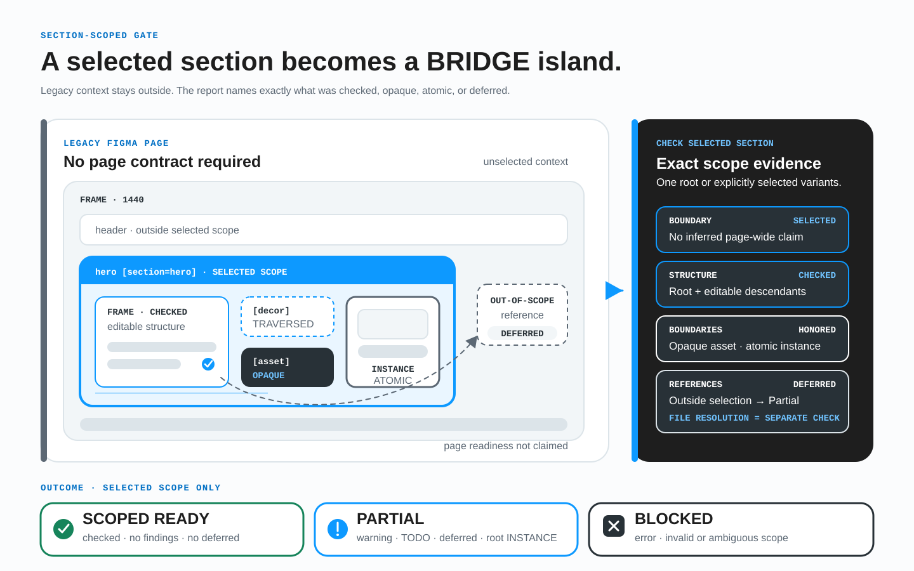

# Внедрение BRIDGE в одной рабочей области

Не начинайте с переименования библиотеки или переноса архива. Проведите небольшой пилот на одной рабочей странице или одной новой выбранной секции, отдайте результат человеку, который не участвовал в её подготовке, и по фактам решите, нужен ли BRIDGE в процессе команды.

## На какие вопросы должен ответить пилот

Пилот полезен, только если даёт практические ответы:

- Понимает ли другой человек без созвона с автором, что это за страница, состояние и адаптивы, куда ведут действия и что нужно экспортировать?
- Находит ли BRIDGE недостающий смысл до начала разработки?
- Сколько времени команда на самом деле тратит на подготовку и проверку?
- Какие замечания блокируют передачу, какие требуют обсуждения, а какие являются намеренными исключениями?

Цель не в том, чтобы довести до блеска один показательный файл. Нужно проверить повторяемую передачу на реальной работе.

## Выберите полезный пилот

Возьмите одну активную страницу: достаточно компактную для совместной проверки и достаточно содержательную, чтобы проявилась настоящая неоднозначность. На ней должны быть:

- хотя бы два адаптива;
- хотя бы одна ссылка или элемент управления с настоящим назначением;
- модальное окно, состояние, форма, якорь или другая цель;
- компонент или секция, чья структура важна для реализации;
- контент и хотя бы один декоративный или экспортируемый ресурс.

Не создавайте для пилота игрушечный экран. Старые файлы переносить заранее не нужно: нетронутый архив не мешает проверить процесс на активной задаче.

### Если окружающий продукт унаследованный

Не добавляйте теги страницы в файл без BRIDGE только ради проверки одной новой секции. Создайте или выберите явную границу:

```text
checkout-summary [section=checkout-summary]
```

Выберите этот корень и запустите `Check selected section`. Для адаптивного свидетельства явно выберите два или больше корней с одним значением `[section]`; команда сравнивает только выбранные варианты и не ищет соседей в унаследованном файле. Не добавляйте секции `[page]`, `[bp]`, `[view]` или `[route]`. Один выбранный корень объявляет один запрошенный контекст источника и не получает ошибку только из-за отсутствия незапрошенных вариантов. Сам выбранный корень может быть `[section=id] [asset]`, если вся секция является одним непрозрачным визуальным ресурсом; секция под другим родительским ресурсом получает Blocked, потому что проверка не проходит сквозь эту границу.



*Технические подписи на схеме даны по-английски: проверяется только поддерево выбранной секции; непрозрачный ресурс останавливает обход, дочерний экземпляр является доверенной атомарной границей, декоративный слой проверяется, а разрешение на уровне файла/хоста выполняется отдельно.*

Результат намеренно ограничен:

- **Ready** — в объявленной выбранной области нет блокирующих ошибок, предупреждений/задач и отложенных проверок;
- **Partial** — блокирующей ошибки источника нет, но осталось предупреждение/задача, выбранный корень `INSTANCE`, неразличимый выбранный контекст или отложенная ссылка, которой нужен поиск на уровне файла/хоста;
- **Blocked** — граница с тегом отсутствует/недопустима или находится под унаследованным непрозрачным ресурсом, выбранные корни вложены друг в друга или смешивают идентификаторы секций либо остаётся блокирующая ошибка.

Полные допустимые адреса `http:`, `https:`, `mailto:` и `tel:` считаются авторски разрешёнными и не вызывают Partial; неполные или некорректные внешние адреса являются блокирующими ошибками синтаксиса, а не отложенными ссылками. Обычный дочерний экземпляр является доверенной атомарной границей и также не снижает Ready; частичным свидетельством источника является только выбранный корень секции, который сам является `INSTANCE`.

Ready означает **готовность исходника секции в объявленных контекстах**, а не готовность страницы-хоста, маршрута, полного набора адаптивов, сквозного сценария, реализации или продукта и не соответствие WCAG. Отдельная проверка файла/интеграции разрешает только ссылки за выбранными корнями, которым нужны сведения файла/хоста, и размещение в хосте. См. [контракт переноса](04-kontrakt-perenosa.md#область-выбранной-секции-внутри-унаследованного-продукта) и [профиль полной проверки секции](08-preflight-checklist.md#профиль-выбранной-секции-в-унаследованном-продукте).

## Назначьте три роли

| Роль | Ответственность |
| --- | --- |
| Дизайнер | Подготавливает выбранную страницу и ничего не объясняет во время тестовой передачи. |
| Разработчик или ревьюер | Читает файл, запускает проверки и записывает каждый вопрос и каждое допущение. |
| Менеджер или владелец процесса | Заранее определяет критерии успеха, удерживает границы пилота и решает, расширять ли практику. |

Один человек может совмещать роли, но автор страницы и участник, проверяющий передачу, должны быть разными людьми.

## Проведите пилот за пять шагов

### 1. Зафиксируйте исходное состояние

До изменений попросите получателя изучить файл без автора. Запишите:

- сколько времени потребовалось, чтобы найти страницу и её адаптивы;
- какие вопросы остались по действиям, целям, состояниям и ресурсам;
- какие допущения иначе попали бы в разработку;
- сколько времени дизайнер потратил бы на дополнительные пояснения.

Это точка сравнения, а не оценка работы дизайнера.

### 2. Добавьте только недостающий смысл

Пройдите [быстрый старт для дизайнера](00-bystryj-start-dlya-dizajnera.md). Геометрия, Auto Layout, данные компонентов и визуальные стили остаются в Figma. Стабильные имена и теги BRIDGE нужны только для намерения, которое сама Figma не хранит.

[Плагин BRIDGE Assistant](https://www.figma.com/community/plugin/1654485530503673254/bridge) помогает поставить основные теги, связать элементы управления с целями и увидеть карту файла. Отдельная учётная запись BRIDGE ему не нужна.

### 3. Проверьте объявленную область

Для страницы BRIDGE выберите корневой фрейм и запустите **Check page**. Для профиля унаследованного хоста выберите корень секции с тегом или его явно выбранные варианты и запустите `Check selected section`. У команд отдельные контракты покрытия; не превращайте секцию в фиктивную страницу ради Page Check.

Манифесты покрытия плагина 0.9.3 фиксируют точные наборы выдаваемых правил для обеих команд: Page Check охватывает 42 правила каталога (40 автоматических и 2 эвристических), а проверка выбранной секции — 26 (24 автоматических и 2 эвристических; 20 локальных и 6 для выбранных вариантов). Числа не складываются, потому что области пересекаются. Точный состав указан в [покрытии Page Check](../../validator/page-check-coverage.json) и отдельном [покрытии выбранной секции](../../validator/section-check-coverage.json).

Во время любой проверки BRIDGE следит только за объявленной границей аудита. Фоновая активность в унаследованных фреймах или на других BRIDGE-страницах того же холста Figma не делает отчёт устаревшим. Если слой внутри проверяемых корней изменился один раз во время чтения, плагин автоматически читает область заново; если эта же область продолжает меняться, проверка останавливается и прямо объясняет, что менялась проверяемая область, а не что BRIDGE редактировал файл.

Полный [каталог содержит 107 правил](../../validator/rules.json). За пределами покрытия плагина применяются проверки контракта, [чеклист дизайнера](17-cheklist-dlya-dizaynerov.md), эвристическое/ручное ревью и QA цели согласно [манифесту покрытия](../../validator/methodology-coverage.json). Поэтому чистый отчёт плагина не означает, что выполнены все 107 проверок. Page Check также считает размещённый экземпляр атомарным; если важна структура секции, отдельно проверяйте редактируемый исходный компонент.

Исправьте неразрешённые блокирующие ошибки. Предупреждения обсуждайте в контексте задачи. Намеренные исключения записывайте вместе с причиной, а не скрывайте.

### 4. Повторите передачу без автора

Снова отдайте подготовленный файл получателю. По одному макету он должен найти:

1. страницу, состояние и обязательные адаптивы;
2. соответствующие элементы на разных ширинах;
3. каждую ссылку или действие и её цель;
4. контент, декор и экспортируемые ресурсы;
5. исключения, преобразования, открытые вопросы и fallback возможностей, влияющие на реализацию.

Запишите те же время и число вопросов, что на первом шаге. Если ключевой ответ всё ещё приходится сообщать устно, контракт остаётся неполным.

### 5. Примите решение по результату

Вместе распределите найденное по четырём группам:

- **блокирует** — без исправления разработчику придётся угадывать;
- **открытый вопрос** — неизвестное имеет область, владельца, блокирующий статус, точку пересмотра и безопасный fallback;
- **принятое исключение** — отклонение намеренное и имеет записанную причину;
- **улучшает процесс** — правило, шаблон или изменение чеклиста можно использовать повторно.

Расширяйте BRIDGE, только если вторая передача стала достаточно понятнее, чтобы оправдать затраты на подготовку. Сохраните результаты пилота: они полезнее общего впечатления «стало лучше».

## Задайте измеримые критерии успеха

Согласуйте порог до начала пилота. Практичная отправная точка:

- получатель за пять минут отвечает на пять вопросов о передаче без участия автора;
- в отчёте плагина не осталось неразрешённых блокирующих результатов;
- у ручного замечания, исключения и открытого вопроса есть владелец, область, блокирующий статус, точка пересмотра и решение или безопасный fallback;
- число уточняющих вопросов и общее время передачи измерены до и после;
- разработчик может начать работу без закрытого контекста, существующего только в чате или на встрече.

Порог времени можно менять под сложность проекта, но измерения и вопросы должны оставаться одинаковыми.

## Расширяйте практику без проекта по миграции

Если пилот сработал:

1. добавьте [чеклист дизайнера](17-cheklist-dlya-dizaynerov.md) в дизайн-ревью;
2. запускайте **Check page** для области страницы или `Check selected section` для изолированной области секции перед передачей;
3. переносите проверенные имена и теги в новые страницы и шаблоны;
4. обсуждайте исключения там же, где остальные решения по реализации;
5. через один-два цикла разработки проверьте ещё одну характерную страницу.

Применяйте BRIDGE к активным материалам по мере их изменения. Не нужно переписывать архив, переименовывать всю библиотеку компонентов или останавливать выпуск, пока каждый исторический файл не начнёт соответствовать методологии.

## Чего не делать

- Не записывайте в теги размеры, интервалы, цвета и другие свойства, которые уже хранит Figma.
- Не переименовывайте всю библиотеку до первой измеренной передачи.
- Не объявляйте каждое предупреждение блокером без продуктового и технического контекста.
- Не подменяйте пилот аккуратным учебным файлом без реальных состояний и действий.
- Не выдавайте 42 правила Page Check или 26 правил проверки секции за автоматизацию полного каталога из 107 правил.
- Не превращайте BRIDGE в отдельное техническое задание, которое расходится с макетом.

## Стоимость, инфраструктура и данные

| Вопрос | Текущий ответ |
| --- | --- |
| Лицензия и оплата | Методология и этот публичный репозиторий доступны по лицензии MIT; реализация плагина приватна. Версия 0.9.3 не запрашивает оплату и не использует платную учётную запись BRIDGE. |
| Инфраструктура | Сервер BRIDGE или отдельная инфраструктура команды не нужны. Опубликованный плагин не имеет сетевого доступа. |
| Хранение данных | Язык и скопированная цель сохраняются локально в хранилище Figma. По явной команде плагин может переименовать выбранные слои или записать метаданные BRIDGE в документ. Во внешний сервис BRIDGE ничего не отправляется. |
| Миграция | Перенос архива не требуется. Начните с одной активной страницы или одной явно выбранной новой секции и расширяйте практику только там, где она доказала пользу. |

Сведения и манифесты покрытия в этом репозитории относятся к версии 0.9.3. Страница Figma Community остаётся источником сведений о доступной для установки сборке, потому что публикация выполняется отдельно вручную. Репозиторий реализации плагина приватен; публичный репозиторий методологии остаётся источником утверждений о контракте, покрытии и процессе.

Сама Figma остаётся средой работы и подчиняется тарифу и правилам рабочей области, которые уже действуют в вашей организации.

## Полезные ссылки

- [Быстрый старт для дизайнера](00-bystryj-start-dlya-dizajnera.md)
- [Figma plugin BRIDGE](https://www.figma.com/community/plugin/1654485530503673254/bridge)
- [Чеклист дизайнера](17-cheklist-dlya-dizaynerov.md)
- [Полный каталог правил](../../validator/rules.json)
- [Покрытие Page Check](../../validator/page-check-coverage.json)
- [Покрытие выбранной секции](../../validator/section-check-coverage.json)
- [Контракт переноса](04-kontrakt-perenosa.md)
- [Текущий статус и план развития](12-roadmap-proekta.md)
