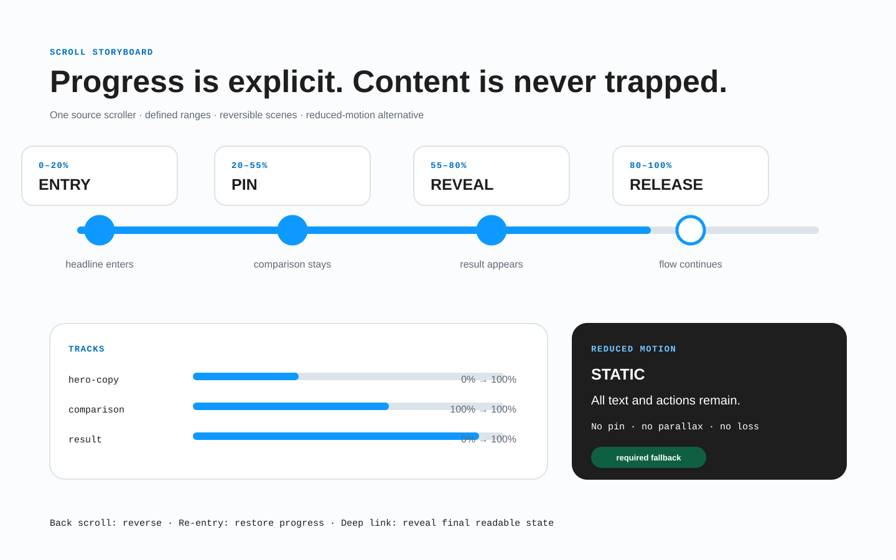

# Контракт движения и длинной прокрутки

Движение — это поведение во времени. Переносимый макет определяет источник прогресса, состояния, временные параметры, прерывание, повторный вход и доступную замену, а не только пару эффектных ключевых кадров.



*Сначала опишите стабильные сцены, затем переходы и условия, которые ими управляют.*

## Начните с цели и стабильных состояний

У каждого движения должна быть цель: сохранить пространственную связь, объяснить причинность, направить внимание, показать прогресс, подтвердить действие или рассказать продуманную историю. Декоративное движение не задерживает и не скрывает выполнение задачи.

Сначала спроектируйте осмысленные состояния без анимации:

```text
feature-story
  scene-intro
  scene-compare
  scene-result
```

Каждое состояние должно быть понятным как неподвижный кадр. Движение определяет переходы между ними. Если смысл существует только во время движения, запасной вариант неполон.

## Объявите источник прогресса

| Источник | Примеры | Что задаёт контракт |
| --- | --- | --- |
| Время | появление, исчезновение, цикл, прогресс | условие запуска, длительность, задержка, повторы, конечное состояние |
| Действие пользователя | нажатие, отправка, перетаскивание, наведение, фокус | событие, равнозначные способы ввода, отмена и обратный ход |
| Прокрутка | прогресс секции или документа | прокручиваемая область, диапазон, ось, смещения, отображение прогресса, повторный вход |
| Видимость | вход элемента в область просмотра и выход | порог, корневая область, однократное или повторное выполнение |
| Медиа или данные | время воспроизведения или живое значение | источник времени/данных, буферизация и отсутствие данных |
| Система | переход маршрута, соединение, настройка пользователя | триггер, сохранение состояния, запасной вариант |

Фразы «по скроллу» недостаточно. Укажите, пересекает ли прокрутка порог, непрерывно управляет прогрессом или выбирает отдельные сцены.

## Контракт временной шкалы

Для каждого перехода или трека задайте:

- стабильные идентификаторы начального и конечного состояния;
- источник прогресса и условие запуска;
- изменяемое свойство или смысловой эффект;
- начальное и конечное значения с единицами;
- длительность или входной диапазон;
- задержку, функцию темпа, повторы и поведение до/после диапазона;
- синхронизацию и последовательность;
- начало преобразования и систему координат;
- отмену, прерывание, изменение размера и содержимого;
- обратный ход и повторный вход;
- результат при уменьшенном движении и без поддержки механизма.

Преобразования и прозрачность часто эффективнее других свойств, если сохраняют геометрию, но производительность не важнее смысла, фокуса и читаемого содержимого. Токены могут задавать общие длительности и темп; сюжетной последовательности всё равно нужен собственный контракт.

## Не переносите временную шкалу в имена слоёв

В макете используйте обычные стабильные идентификаторы:

```text
История [section=feature-story]
  story-visual
  scene-intro
  scene-compare
  scene-result
```

Не создавайте плоский набор тегов `[fade]`, `[duration]`, `[easing]`, `[pin]` и `[scroll-start]`. Ссылайтесь на идентификаторы из структурированных метаданных BRIDGE:

> **Неполный фрагмент модуля.** Здесь показан только `bridge.motion`, а обязательные поля оболочки намеренно опущены. Перед обменом или проверкой полного контракта вставьте его в обязательную оболочку `bridge` из [контракта переноса](04-kontrakt-perenosa.md#обязательная-оболочка).

```json
{
  "bridge": {
    "motion": {
      "sequences": [{
        "sequenceId": "feature-story-scroll",
        "purpose": "Explain the product workflow in three steps",
        "driver": {
          "type": "scroll-progress",
          "source": "document",
          "range": { "start": "feature-story block-start 80%", "end": "feature-story block-end 20%" },
          "axis": "block"
        },
        "scenes": [
          { "id": "intro", "range": [0, 0.32], "content": "scene-intro" },
          { "id": "compare", "range": [0.32, 0.68], "content": "scene-compare" },
          { "id": "result", "range": [0.68, 1], "content": "scene-result" }
        ],
        "pin": { "element": "story-visual", "mode": "sticky", "container": "feature-story" },
        "reentry": "derive-from-current-progress",
        "reducedMotion": "show-all-scenes-in-document-order"
      }]
    }
  }
}
```

В вебе подходящие случаи можно связать со [спецификацией CSS Scroll-driven Animations](https://www.w3.org/TR/scroll-animations-1/). Другая платформа вправе использовать иной механизм, сохраняя контракт.

## Истории с длинной прокруткой

Такой сценарий определяет:

1. **Сцены:** стабильные идентификаторы и смысл каждой сцены.
2. **Источник прокрутки:** документ или именованный контейнер; вложенные области объявляются явно.
3. **Диапазон:** начальное и конечное смещения и система координат — область просмотра или контейнер.
4. **Сопоставление:** непрерывный прогресс, пороги, привязка или выбор дискретных сцен.
5. **Раскладку:** зарезервированную высоту, закреплённую область и содержимое в обычном потоке.
6. **Вход:** начальное состояние при движении сверху, снизу, по якорю или после восстановления истории.
7. **Выход:** конечное состояние и очистку в обоих направлениях.
8. **Изменения:** пересчёт после смены размера, ориентации, загрузки шрифта, локализации и динамического содержимого.
9. **Запасной вариант:** читаемый обычный поток без JavaScript, sticky или временной шкалы прокрутки.

Нельзя рассчитывать только на движение вперёд. Обратная прокрутка детерминированно обращает шкалу или переводит в заданное стабильное состояние. Глубокая ссылка в середину страницы не должна требовать прокрутки от начала ради инициализации.

## Закреплённые области

Предпочитайте нативное `sticky`, если оно соответствует замыслу. Контракт задаёт содержащий блок, отступ, границы начала и конца, зарезервированное место в потоке, наложение и поведение, когда закреплённый объект выше доступной области.

Закреплённое представление не должно:

- менять порядок значимого содержимого в дереве доступности;
- перехватывать прокрутку колесом, касанием или клавиатурой;
- скрывать сфокусированный элемент под шапкой или наложением;
- дублировать читаемое содержимое в активной и неактивной копии;
- требовать определённой высоты устройства для перехода дальше.

Порядок документа остаётся порядком чтения и клавиатуры. Визуальные слои могут перекрывать его, но не заменять.

## Повторный вход, обратный ход и прерывание

Для каждой последовательности решите:

- **повтор:** один раз за сеанс, за показ или при каждом входе;
- **повторный вход:** начать заново, продолжить, вычислить из текущего прогресса или оставить завершённой;
- **обратный ход:** обратить шкалу, применить другой переход или изменить мгновенно;
- **прерывание:** завершить, отменить, продолжить от текущего значения или сохранить прогресс;
- **частые события:** отложить, поставить в очередь, заменить или игнорировать по детерминированному правилу;
- **маршрут и история:** восстановить по URL, сохранённому состоянию или текущей прокрутке;
- **вход фокуса:** немедленно показать цель, не ожидая анимации.

Нельзя использовать `animationend` как единственный путь к обязательному продуктовому состоянию: уменьшенное движение, фоновая вкладка или отмена могут обойти событие.

## Уменьшенное движение и запасные варианты

BRIDGE требует отдельного решения для уменьшенного движения, даже если формальное соответствие WCAG не обязывает убирать каждую анимацию. Учитывайте настройку `prefers-reduced-motion`, описанную в [CSS Media Queries](https://www.w3.org/TR/mediaqueries-5/#prefers-reduced-motion).

Для каждой последовательности выберите стратегию:

- убрать необязательный параллакс, масштабирование, вращение и большие перемещения;
- заменить движение мгновенной сменой или коротким растворением;
- остановить автоматические циклы и дать управление, если движение необходимо;
- вывести сцены длинной истории в обычном порядке документа;
- сохранить тот же прогресс, результат, фокус и целевое состояние.

Почти нулевая длительность не решает проблему, если остаются перехват прокрутки, вспышки, закрепление или скрытое содержимое. Без скриптов или нужного API все важные материалы и действия остаются доступны.

## Движение в адаптивах

Для движения действует правило одного дерева. Координаты и длина пути могут меняться, но идентификаторы, цель, результат состояния и смысл завершения сохраняются.

Если узкое представление заменяет закреплённую историю на раскрывающийся список или статическую последовательность, объявите [адаптивное преобразование](03-adaptivy-i-breakpointy.md): сопоставьте сцены, сохраните порядок чтения и действий, опишите фокус и историю, обеспечьте одинаковый результат при уменьшенном движении.

## Условие готовности

Последовательность готова, если ревьюер может ответить:

- Какова цель и какие стабильные состояния существуют без движения?
- Что управляет прогрессом и каковы точные диапазоны и временные параметры?
- Что происходит при обратном ходе, повторном входе, частом вводе, изменении размера и глубокой ссылке?
- Может ли пользователь остановить или приостановить движение там, где это требуется?
- Сохраняется ли смысловой порядок при закреплении?
- Остаётся ли клавиатурный фокус видимым и попадает ли на уже созданную цель?
- Сохраняет ли уменьшенное движение содержимое, действия, состояние и выполнение задачи?
- Работает ли запасной вариант без предпочтительного механизма?

В реализации применяйте критерий WCAG 2.2 [«Пауза, остановка, скрытие»](https://www.w3.org/TR/WCAG22/#pause-stop-hide) и ограничение [частоты вспышек](https://www.w3.org/TR/WCAG22/#three-flashes-or-below-threshold).
