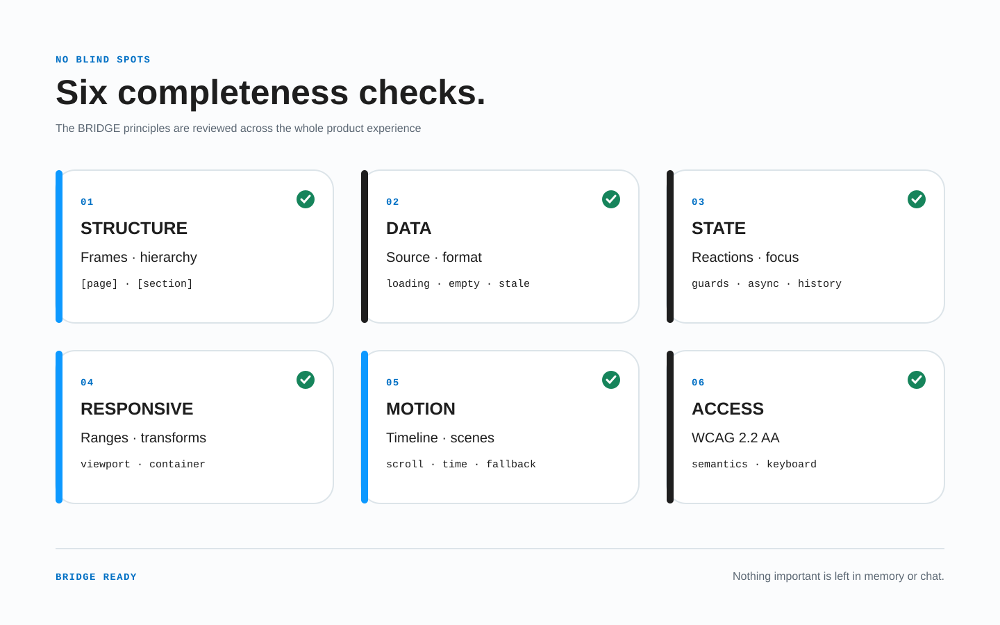

# Профиль доступности

BRIDGE ориентируется на **WCAG 2.2, уровень AA** для итоговой реализации. Этот профиль распределяет требования между дизайном, контрактом, реализацией и проверкой. Сам файл Figma не может соответствовать стандарту: соответствие оценивают в готовом продукте по всем применимым критериям [WCAG 2.2](https://www.w3.org/TR/WCAG22/).



*Нужны свидетельства в дизайне, структурированное намерение, семантическая реализация и пользовательские проверки. Ни один уровень не доказывает доступность в одиночку.*

## Нормативная основа

- Версия WCAG: **2.2**.
- Целевой уровень: **AA**, включая каждый применимый критерий A и AA, а не только пункты ниже.
- Область: полные страницы и процессы, адаптивные и языковые варианты, авторизованные состояния, ошибки, наложения, встроенное содержимое и поддерживаемые платформы.
- Технологии, на поддержку доступности которых опирается продукт, объявляет команда реализации и проверяет с репрезентативными браузерами и вспомогательными технологиями.
- Более строгие продуктовые требования этого профиля остаются обязательными, даже если формальное исключение WCAG допустимо.

Используйте [WAI-ARIA Authoring Practices](https://www.w3.org/WAI/ARIA/apg/) для ожидаемых моделей управления виджетами. Предпочитайте нативную семантику и элементы платформы: ARIA не исправляет неподходящую модель взаимодействия.

## Ответственность по этапам

| Этап | Обязательные свидетельства |
| --- | --- |
| Дизайн | Порядок чтения, названия, метки, состояния, фокус, контраст, перестроение, размеры целей, альтернативы, уменьшенное движение. |
| Контракт | Стабильные роли и связи, фокус и объявления реакций, эквиваленты данных, исключения и владельцы. |
| Реализация | Нативная семантика, клавиатурное управление, дерево доступности, настройки пользователя, адаптивное поведение. |
| Проверка | Автоматические проверки плюс ручные тесты клавиатуры, масштаба, скринридера, контраста, движения, медиа и полных задач. |

Не оставляйте доступность разработчику как неопределённую финальную доработку. Автоматический отчёт не доказывает соответствие.

## Семантика и порядок чтения

Контракт страницы определяет:

- понятный заголовок документа, основной язык и смену языка;
- области шапки, навигации, основного и дополнительного содержимого, форм и подвала, где они уместны;
- логическую иерархию заголовков по смыслу, а не размеру шрифта;
- списки, таблицы, цитаты, метки, статусы и связи согласно назначению;
- текстовую альтернативу изображения или явное декоративное назначение;
- осмысленный порядок DOM/дерева доступности независимо от визуального позиционирования.

Метаданные Figma, источник компонента, стабильные имена, `[decor]` и структурированный контракт служат свидетельствами. Не создавайте плоский тег для каждого HTML-элемента. Адаптер выбирает нативную реализацию, сохраняя заявленную семантику.

## Доступные названия, метки и описания

У каждого элемента управления и поля есть программное название, совпадающее с видимой меткой или включающее её. Элементу только с иконкой нужно явное стабильное название. Дополнительное описание связывает инструкцию, единицу, ограничение, ошибку и последствие, но не заменяет метку.

Требования:

- видимый текст по умолчанию становится доступным названием;
- одно действие сохраняет одно название между адаптивами и состояниями;
- подсказка внутри поля не заменяет метку;
- текст ссылки описывает цель в контексте;
- повторяющиеся «Подробнее» получают различимый контекст;
- статус выражен текстом, а не одним цветом;
- обязательность и формат объяснены до ошибки;
- ошибка указывает поле, причину и способ исправления, если он известен.

Короткий `[a11y-label=...]` может назвать элемент только с иконкой, если в источнике нет лучшего свойства. Подробная помощь, ошибка и связи хранятся в структуре, а не в дополнительных тегах имени слоя.

## Клавиатура и фокус

Вся функциональность доступна с клавиатуры или равнозначного последовательного ввода без ловушки. Контракт задаёт:

- логический порядок Tab на основе смысловой структуры;
- управление стрелками внутри виджета, когда его требует признанный шаблон;
- видимый индикатор фокуса во всех темах и состояниях;
- начальный и восстановленный фокус для диалогов, панелей, меню, маршрутов, проверки, удаления и обновлений;
- пропуск повторяющихся блоков;
- видимость фокуса рядом с закреплённой шапкой, cookie-баннером, наложением и прокручиваемой областью;
- альтернативы перетаскиванию, жестам по траектории, наведению и действиям только указателем.

Не используйте положительный `tabindex` или визуальный порядок вместо правильного порядка источника. На уровне AA сфокусированный элемент не может быть полностью скрыт авторским содержимым по критерию [Focus Not Obscured (Minimum)](https://www.w3.org/TR/WCAG22/#focus-not-obscured-minimum). BRIDGE дополнительно требует намеренно спроектированный индикатор, а не надежду на случайный контраст браузера и темы.

## Визуальные требования

Реализация как минимум обеспечивает:

- контраст текста **4.5:1** либо **3:1** для крупного текста по определению WCAG;
- контраст важных компонентов интерфейса и графических объектов **3:1**;
- передачу информации не одним цветом;
- работу при увеличении текста до **200%**;
- перестроение без двухмерной прокрутки страницы при эквивалентной ширине **320 CSS px**, кроме содержимого, которому действительно нужны два измерения;
- отсутствие потерь при пользовательских настройках интервалов текста из WCAG;
- портретную и альбомную ориентацию, если одна из них не является необходимой;
- инструкции, которые не зависят только от формы, цвета, звука, положения или сенсорного описания.

Проверяйте отрисованный результат, а не имя токена. Название `accessible-blue` ничего не доказывает без фактического фона и прозрачности.

## Размер цели и указатель

Критерий WCAG 2.2 AA [«Минимальный размер цели»](https://www.w3.org/TR/WCAG22/#target-size-minimum) требует область не меньше **24 × 24 CSS px** либо выполнение условий расстояния/исключений. BRIDGE рекомендует **44 × 44 CSS px** для основных сенсорных элементов и считает 24 px обязательным минимумом AA.

Также задайте:

- расстояние между соседними разрушительными или частыми действиями;
- отмену действия по нажатию вниз, где применимо;
- альтернативу перетаскиванию;
- альтернативу одним указателем для сложного жеста;
- сохранение видимых и рабочих меток на узкой ширине и при масштабе.

Недостаточно увеличить нарисованную иконку, оставив маленькую активную область.

## Формы, ошибки и аутентификация

Формы следуют [контракту машин состояний](22-sostoyaniya-i-reakcii.md) и обеспечивают:

- метки, инструкции, назначение поля и автозаполнение, где применимо;
- идентификацию ошибки и предложение исправления, когда оно известно;
- сводку ошибок и детерминированный фокус/объявление в сложной форме;
- проверку, подтверждение, отмену или возможность исправления юридических, финансовых и изменяющих данные операций, где требуется;
- сохранение значений после ошибки проверки или сервера;
- отсутствие повторного ввода уже сообщённых данных в одном процессе, кроме допустимых исключений;
- аутентификацию, которая не зависит только от когнитивного теста и поддерживает менеджер паролей и вставку.

Недоступная кнопка отправки не должна быть единственным признаком незаполненной формы.

## Динамическое содержимое и асинхронный статус

Загрузка, результаты, ошибки, фоновое сохранение и соединение получают видимую обратную связь и, где нужно, вежливое или срочное живое объявление. Задайте:

- что и когда объявляется;
- становится ли существующее содержимое занятым, устаревшим или недоступным;
- как частые обновления объединяются без шума;
- остаётся ли фокус на месте или перемещается ради конкретной задачи;
- как пользователь находит добавленное содержимое;
- продление таймаута, повтор и восстановление.

Не перемещайте фокус только ради озвучивания статуса. Используйте семантический статус и сохраняйте место пользователя, когда это возможно.

## Данные, диаграммы и сложная графика

Применяйте [контракт данных и визуализации](20-dannye-i-vizualizaciya.md). Таблицы сохраняют связи заголовков; диаграммы и карты имеют название, резюме, обозначения не только цветом, управление с клавиатуры и доступ к значениям через таблицу, список или скачивание. Декор исключается из дерева доступности.

Сложному изображению нужна ближайшая краткая альтернатива и расположенное рядом или связанное подробное описание, позволяющее получить ту же важную информацию. Официальные схемы приведены в [руководстве WAI](https://www.w3.org/WAI/tutorials/images/complex/).

## Движение, время, вспышки и медиа

Применяйте [контракт движения](21-motion-i-scroll.md). Учитывайте настройку уменьшенного движения, сохраняйте задачу в статическом варианте, давайте управление подходящим движущимся/обновляемым содержимым и не превышайте порог вспышек WCAG.

Для ограничения времени опишите предупреждение, продление, сохранение и повторную аутентификацию. Для записанного и живого аудио/видео подготовьте субтитры, аудиоописание, расшифровку, управление и альтернативы, требуемые всеми применимыми критериями A/AA. Автозапуск звука исключается или управляется согласно применимому критерию.

## Адаптивные преобразования

Преобразование сохраняет:

- доступное название, роль, значение, состояние и связи;
- порядок чтения и фокуса;
- выполнение задачи с клавиатуры и указателя;
- ошибки, статус, происхождение данных и помощь;
- путь к содержимому за раскрытием;
- восстановление фокуса и истории при смене представления.

Переход таблицы в карточки или навигации в меню не разрешает удалить заголовки, связи или действия. Проверяйте изменения по контейнеру и по области просмотра.

## Направление, режим письма и двунаправленный текст

Проверка охватывает поддерживаемые `ltr`/`rtl` и режимы письма, а не только перевод строк. Сохраняйте логический порядок чтения и клавиатуры, не заставляя его следовать визуальному отражению. Проверяйте смешанные имена людей, телефоны, даты, идентификаторы, код и цифры; зеркальность иконок; оси и категории диаграмм; фокус; положение ошибок и объявления. Используйте логические start/end и задавайте основное направление встроенных значений, чтобы вспомогательная технология получала понятную последовательность.

## Структурированные метаданные доступности

Используйте структуру только для намерения, которого нет в источнике и компонентах:

> **Неполный фрагмент модуля.** Здесь показан только `bridge.accessibility`, а обязательные поля оболочки намеренно опущены. Перед обменом или проверкой полного контракта вставьте его в обязательную оболочку `bridge` из [контракта переноса](04-kontrakt-perenosa.md#обязательная-оболочка).

```json
{
  "bridge": {
    "accessibility": {
      "profile": { "standard": "WCAG", "version": "2.2", "level": "AA" },
      "elements": [{
        "element": "revenue-chart",
        "name": "Monthly revenue compared with target",
        "description": "Actual revenue exceeded target in 8 of 12 months",
        "details": "revenue-table",
        "readingOrder": ["chart-title", "chart-summary", "revenue-chart", "revenue-table"],
        "reducedMotion": "static-series",
        "testIds": ["a11y-chart-keyboard", "a11y-chart-values"]
      }]
    }
  }
}
```

Метаданные дополняют, но не заменяют видимое содержимое и семантику реализации.

## Обязательная матрица проверки

Как минимум проверьте репрезентативные полные задачи:

1. только клавиатурой в прямом и обратном порядке, включая наложения и ошибки;
2. скринридером и клавиатурой в объявленных командой сочетаниях платформ;
3. при увеличении текста 200% и масштабе браузера 400% с перестроением на узкой эквивалентной ширине;
4. с пользовательскими интервалами текста и длинной локализацией;
5. в принудительном/высококонтрастном режиме, где он поддерживается;
6. с уменьшенным движением и без предпочтительного механизма анимации;
7. с указателем и сенсорным вводом: размеры, отмена, альтернативы жестам и ориентация;
8. автоматическими правилами, затем обязательной ручной проверкой;
9. в состояниях загрузки, пустоты, частичных и устаревших данных, ошибки, отсутствия сети, ошибки формы и отсутствия прав;
10. для каждого объявленного адаптивного преобразования.
11. для поддерживаемых RTL/bidirectional и режимов письма, включая диаграммы и смешанные идентификаторы.

Записывайте браузер, платформу, вспомогательную технологию и версию, сценарий, ожидаемый и фактический результат, свидетельство. Одно сочетание скринридера и браузера не доказывает универсальную поддержку.

## Исключения и заявления о соответствии

Исключение указывает точный критерий или требование BRIDGE, область, свидетельство, влияние на пользователя, причину, владельца, компенсацию, согласование и дату пересмотра/окончания. Фраза «техническое ограничение» без доказательства и плана недопустима.

Нельзя заявлять соответствие WCAG по макету, отдельному компоненту, автоматической оценке или незавершённому пути. Заявление для выпуска возможно только после проверки всех применимых критериев в полном реализованном объёме страниц и процессов с честным раскрытием известных нарушений.
