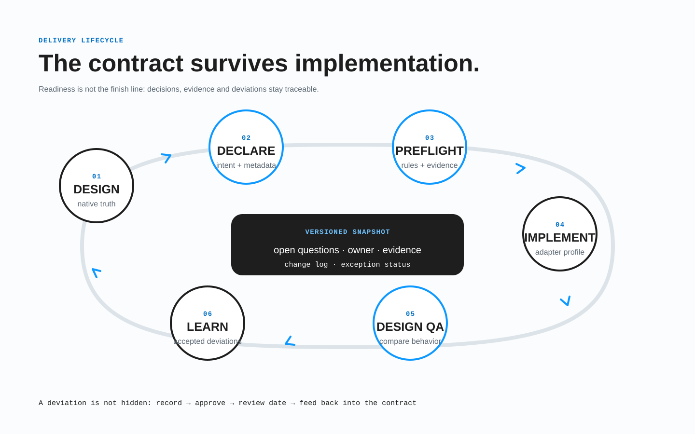

# Жизненный цикл передачи

BRIDGE завершён только тогда, когда намерение прослеживается от макета до выпуска. Жизненный цикл:

> **дизайн → контракт → реализация → проверка → выпуск или объявленное отклонение**



*Отклонение — управляемая ветвь, которая возвращается к проверке, а не короткий путь в обход контракта.*

## Одна цепочка свидетельств

Каждое важное требование получает стабильный идентификатор и ссылки на свидетельства:

```text
REQ-CATALOG-017
  design: Catalog / Default / 1200 → product-grid
  contract: bridge.data.displays → product-grid
  implementation: ProductGrid + catalog query adapter
  tests: catalog-grid-default, catalog-grid-empty, catalog-grid-keyboard
  deviations: none
```

Не создавайте пять несвязанных спецификаций. Figma показывает визуальные и структурные свидетельства; метаданные BRIDGE фиксируют недоступное Figma намерение; код реализует; тесты проверяют результат; отклонения описывают известные различия. Уровни связывают стабильные идентификаторы.

## Роли и ответственность

| Роль | За что отвечает |
| --- | --- |
| Владелец продукта/дизайна | Продуктовый смысл, состояния, свидетельства в макете, содержимое, адаптивное намерение. |
| Владелец контракта | Согласованность, сопоставление идентичности, структурированные метаданные, критерии приёмки, история изменений. |
| Владелец реализации | Семантическое поведение, решения целевой платформы, код и свидетельства реализации. |
| Владелец качества/доступности | Покрытие, окружения, ожидаемые результаты, находки и регрессионные свидетельства. |
| Согласующий отклонение | Решение о влиянии на пользователей и бизнес, компенсация, владелец, срок и продолжение работы. |

Один человек может совмещать роли. Автор не должен оставаться единственным толкователем макета, а известное расхождение нельзя молча согласовать только силами разработчика, который его создал.

## Запись жизненного цикла

У единицы передачи — страницы, сценария, секции или компонента — одна запись:

> **Неполный фрагмент модуля.** Здесь показан только `bridge.lifecycle` и для контекста `contractVersion`; остальные обязательные поля оболочки намеренно опущены. Перед обменом или проверкой полного контракта вставьте запись в обязательную оболочку `bridge` из [контракта переноса](04-kontrakt-perenosa.md#обязательная-оболочка).

```json
{
  "bridge": {
    "contractVersion": "0.2.0",
    "lifecycle": {
      "transferId": "catalog-default",
      "contractRevision": "7",
      "sourceRevision": "figma-version-2026-08-13T10:20Z",
      "targetRevision": "build-1842",
      "status": "qa",
      "owners": {
        "design": "catalog-design",
        "contract": "design-systems",
        "implementation": "storefront",
        "qa": "quality"
      },
      "requirements": ["REQ-CATALOG-017", "REQ-CATALOG-021"],
      "evidence": {
        "design": ["page=catalog;view=default;bp=1200"],
        "tests": ["catalog-grid-default", "catalog-grid-keyboard"]
      },
      "deviations": []
    }
  }
}
```

Имена приведены для примера. Запись может храниться в репозитории, системе задач, плагине дизайна или сборке, но она должна версионироваться, иметь ссылки и передаваться вместе с единицей.

## Выбранная секция внутри унаследованного продукта

Жизненный цикл области секции имеет два разных этапа источника и интеграции:

1. **проверка исходника выбранной секции** — фиксирует корни `[section=<stable-id>]`, границу выбранного поддерева, выбранные контексты, ревизию источника, локальные замечания и отложенные зависимости;
2. **проверка интеграции файла/хоста** — проверяет внутренние маршруты/якоря и цели действий/компонентов/данных, требующие поиска вне выбранных корней, размещение у родителя и обрезку/слои, связи маршрута/страницы, обязательные продуктовые контексты, семантику страницы, рабочее поведение и доступность реализации. Полные допустимые адреса `http:`, `https:`, `mailto:` и `tel:` уже считаются авторски разрешёнными на этапе источника; неполное или некорректное внешнее значение блокирует этот этап, а не откладывается.

Этап источника недопустим, если выбранная секция находится под другим непрозрачным родительским `[asset]`: такая область получает Blocked до обхода. Точный выбранный корень `[section=id] [asset]` остаётся допустимым непрозрачным цельным визуальным исходником, для которого внутренняя проверка раскладки неприменима.

`Check selected section` создаёт свидетельство Ready, Partial или Blocked для первого этапа. Храните эту метку вместе с областью и матрицей покрытия; не подменяйте ею `bridge.lifecycle.status` и не выдавайте её за прохождение второго этапа. Ready исходника секции в одном контексте допустим, если был запрошен только этот контекст. Отложенная ссылка с файловым разрешением или выбранный корень секции, который сам является `INSTANCE`, делает результат источника Partial до появления свидетельства связанного этапа. Обычные дочерние экземпляры являются доверенными атомарными границами и не снижают Ready.

Унаследованный хост — объявленная граница, а не принятое отклонение BRIDGE и не скрытое требование миграции. Запись жизненного цикла указывает `hostCompliance: legacy-out-of-scope`, связывает каждую внешнюю зависимость с владельцем/точкой пересмотра и не позволяет превратить «исходник секции готов» в «страница/продукт готовы» в следующих статусах или заметках выпуска.

## Этап 1: дизайн

Владелец дизайна подготавливает репрезентативные рабочие свидетельства:

- идентификаторы страницы, состояния и контрольных ширин, а также настоящий маршрут, если известен;
- одно логическое дерево адаптивов и каждое объявленное преобразование;
- стабильную идентичность элемента и происхождение шаблона/компонента;
- реалистичное содержимое и примеры рабочих данных;
- полные реакции, цели, формы, ожидание и ошибки;
- состояния движения и запасные представления;
- намерение доступности и альтернативы;
- важные медиа/часть опыта, art direction ресурсов и репрезентативные условия ограниченных возможностей;
- известные ограничения целевой платформы и кандидаты в исключения.

**Условие дизайна:** ревьюер, не являющийся автором, определяет структуру, варианты, смысл содержимого и данных, действия, цели, адаптивное поведение, доступность и нерешённые вопросы без приватного объяснения.

Результат: версия макета, перечень сценариев данных, открытые решения и начальные идентификаторы требований.

## Этап 2: контракт

Владелец контракта объединяет свидетельства, а не дублирует их:

1. извлекает техническую правду из Figma или другого источника;
2. разрешает идентичность роли, шаблона, экземпляра макета, рабочих данных и цели;
3. присоединяет контракты данных, адаптивов, реакций, движения, доступности и жизненного цикла;
4. задаёт критерии приёмки и возможности целевой среды;
5. превращает каждое неизвестное или неподдерживаемое условие в открытый вопрос с областью, владельцем, блокирующим статусом, точкой пересмотра и безопасным fallback;
6. задаёт объём данных, порог виртуализации/пагинации, доставку ресурсов и бюджеты производительности владельца реализации;
7. проверяет ссылки, цели, схемы, достижимость состояний, паритет и исключения;
8. фиксирует ревизию контракта для реализации.

**Условие контракта:** каждое решение либо задано явно, либо наследуется из зафиксированного контракта компонента/системы, либо записано как вопрос с владельцем, блокирующий затронутую область. Важный смысл не остаётся только в переписке или на встрече.

Результат: версия источника, структурированный контракт, матрица трассировки, возможности целевой среды, отчёт проверки и согласованный объём реализации.

## Этап 3: реализация

Владелец реализации сопоставляет контракт с платформой. Адаптер или разработчик:

- сохраняет смысловую идентичность и связи, а не слепо копирует координаты;
- использует нативное поведение и дизайн-систему, когда они соответствуют контракту;
- сначала реализует точные фреймы/сцены, затем плавное и контейнерное поведение;
- связывает рабочие записи по стабильным ключам данных, а не порядку примеров Figma;
- реализует достижимые состояния, реакции, фокус/историю и запасные варианты;
- записывает решения целевой платформы, невидимые в макете;
- реализует и измеряет бюджеты ресурсов, данных, загрузки, низкой скорости, offline, data saver, low power и запасных возможностей;
- сообщает о невозможном или вредном требовании до самовольной замены.

**Условие реализации:** проект собирается, детерминированные проверки контракта проходят, требования связаны со свидетельствами в коде и известные расхождения не скрыты.

Результат: ревизия реализации, решения сопоставления, автоматические тесты и кандидаты в отклонения.

## Этап 4: проверка

Качество проверяет наблюдаемый результат против зафиксированного контракта, а не памяти или одного скриншота.

Покрытие включает:

- точные контрольные ширины и диапазоны между ними;
- контейнерные изменения и каждое структурное преобразование;
- обычные и стрессовые данные, все состояния и локализацию;
- успех, ошибочный ввод, ожидание, пустоту, частичный результат, ошибку, отмену, повтор и историю;
- обратный ход, повторный вход и уменьшенное движение;
- клавиатуру, фокус, масштаб и перестроение, скринридер, контраст, размер целей и медиа;
- поддерживаемые браузеры, устройства, среды и запасные условия;
- размеры/качество/art direction/приоритет ресурсов и пороги объёма данных/виртуализации в заявленных профилях;
- низкую скорость, offline, data saver, low power, отсутствие возможности и свидетельства бюджета, где применимо;
- наследование системы компонентов и визуальную регрессию важных состояний.

Результат имеет статус `pass`, `fail`, `not-applicable`, `blocked` или `accepted-deviation` и содержит свидетельство и окружение. «Похоже» не является результатом.

**Условие проверки:** у каждого критерия есть результат; блокеры устранены; согласованные отклонения одобрены и видимы; для поведения высокого риска существует регрессионное покрытие.

Результат: связанный отчёт, свидетельства, дефекты, согласованные отклонения и рекомендация выпуска.

## Этап 5: выпуск и эксплуатация

При выпуске свяжите:

- ревизию дизайна/источника;
- версии контракта, правил и схемы;
- ревизию реализации/сборки;
- окружение и версию свидетельств проверки;
- активные отклонения и сроки пересмотра.

После выпуска рабочие данные могут обнаружить длины текста, объёмы, устройства, проблемы вспомогательных технологий и ограничения производительности, которых не было в примерах. Верните знания в исходный макет, контракт компонента, примеры и тесты. Не исправляйте продакшен бесконечно, оставляя канонический контракт неверным.

## Протокол открытого вопроса

BRIDGE обещает отсутствие **неучтённых** неизвестных, а не всезнание. Решение может оставаться `unknown`, `unsupported` или `TBD` только в `bridge.openQuestions[]` со стабильным идентификатором, точной областью, владельцем, блокирующим статусом, сроком или этапом пересмотра, безопасным fallback и ссылкой на решение после закрытия.

На каждом этапе:

- пересмотрите вопросы, область которых переходит дальше;
- заблокируйте область, если fallback опасен, недоступен, вводит в заблуждение, разрушает данные или не проверяется;
- перенесите неблокирующий fallback в критерии реализации и проверки;
- закройте запись только со связанным решением и обновлёнными свидетельствами;
- эскалируйте просрочку вместо молчаливого предположения.

Вопрос только в разговоре, чате, несвязанной задаче или памяти участника — слепая зона и провал готовности.

## Управление изменениями и дрейф

Изменение начинается у владельца истины, которую оно затрагивает:

| Изменение | Сначала обновить | Затем перепроверить |
| --- | --- | --- |
| Текст, визуальная иерархия или продуктовый путь | Макет | Контракт, реализацию, тесты |
| Схема, источник или формат данных | Контракт данных | Примеры, отображение, состояния, тесты |
| Реакция или состояние | Контракт реакций | Макеты, фокус/историю, реализацию, тесты |
| API компонента или ограничение платформы | Контракт реализации/системы | Сопоставление дизайна, отклонения, регрессию |
| Проблема доступности | Требование и затронутые свидетельства | Дизайн, контракт, реализацию, все варианты |

Анализируйте влияние по стабильному идентификатору и требованию. Изменение источника после фиксации либо создаёт новую ревизию контракта, либо явно доказывается как несемантическое. Молчаливая замена скриншота создаёт дрейф.

## Протокол отклонения

**Отклонение** — намеренное и проверенное различие между принятым контрактом и реализацией или возможностями цели. Это не скрытая временная заплатка.

Отклонение хранится в `bridge.lifecycle.deviations`:

> **Неполный фрагмент модуля.** Здесь изолирована одна запись `bridge.lifecycle.deviations`, а остальные поля жизненного цикла и обязательной оболочки намеренно опущены. Вставьте запись в полный модуль жизненного цикла внутри обязательной [оболочки контракта](04-kontrakt-perenosa.md#обязательная-оболочка).

```json
{
  "bridge": {
    "lifecycle": {
      "deviations": [{
        "id": "DEV-CATALOG-004",
        "requirement": "REQ-CATALOG-021",
        "scope": ["catalog", "catalog-360"],
        "difference": "Comparison table uses horizontal scroll instead of the declared card transformation",
        "reason": "Card mapping loses grouped header relationships in target version",
        "impact": "Comparison remains available with preserved table semantics and no data loss, but narrow-screen users need additional horizontal navigation",
        "mitigation": "Sticky first column, overflow instructions, edge affordance",
        "evidence": ["qa-catalog-360-table-scroll"],
        "owner": "storefront",
        "approvedBy": "product-and-accessibility",
        "status": "accepted",
        "reviewDate": "2026-11-30",
        "resolution": "Reassess after target table component upgrade"
      }]
    }
  }
}
```

Правила:

- указать нарушенное требование и точную область;
- описать влияние на пользователя, доступность, данные и сопровождение;
- сравнить реалистичные альтернативы;
- подготовить компенсацию и свидетельства проверки;
- назначить ответственного и согласующего;
- задать срок временного отклонения;
- показать запись при передаче, проверке и выпуске;
- закрыть её только после сближения контракта и реализации и повторного теста.

Отклонение, нарушающее WCAG 2.2 AA, нельзя переименовать в соответствие. Безопасность, приватность, право и целостность данных важнее визуальной точности и передаются соответствующему владельцу.

## Определение готовности и завершения

### Готово к реализации

- [ ] Объём и ревизии зафиксированы.
- [ ] Идентичность и сопоставление цели однозначны.
- [ ] Структурированные контракты покрывают данные, преобразования, реакции, движение и доступность, где применимо.
- [ ] Есть критерии приёмки и сценарии проверки.
- [ ] У решений есть владельцы; блокирующие решения приняты.
- [ ] Каждое оставшееся неизвестное/неподдерживаемое условие оформлено как вопрос с областью, владельцем, точкой пересмотра и безопасным проверенным fallback.
- [ ] Объявлены возможности цели, важные медиа/опыт, объём данных, деградация и бюджеты реализации.
- [ ] Кандидаты в отклонения не спрятаны как «детали реализации».

Для передачи выбранной секции Ready проверки источника закрывает только часть списка о свидетельствах источника. Единица готова к реализации лишь тогда, когда у каждой блокирующей/отложенной зависимости, нужной для планируемой реализации, есть связанное свидетельство или безопасный запасной путь с владельцем. Готовность страницы/продукта и соответствие WCAG остаются отдельным последующим решением в своей области.

### Готово к выпуску

- [ ] Реализация прослеживается до принятого контракта.
- [ ] Пройдены обязательные точные, плавные, событийные, информационные, анимационные и доступные сценарии.
- [ ] Ошибка исправлена, заблокирована с владельцем или согласована как видимое отклонение.
- [ ] У активных отклонений есть компенсация и дата пересмотра.
- [ ] Связаны версии источника, контракта, сборки и отчёта.
- [ ] Рабочая обратная связь возвращается в канонический источник.

## Пример изменения от начала до конца

Таблица каталога подготовлена на 1200 и 360 px. Контракт сохраняет одно дерево до ширины контейнера `comparison-panel` 480 px, затем превращает таблицу в раскрывающиеся карточки с сопоставлением каждой колонки. В целевом компоненте выясняется, что такое представление не сохраняет выбор нескольких строк.

Команда не удаляет выбор молча:

1. `REQ-CATALOG-021` требует сохранять выбор при смене представления.
2. Разработчик записывает пробел возможностей до замены поведения.
3. Дизайн сравнивает семантическую таблицу с горизонтальной прокруткой и доработку раскрывающегося компонента.
4. Владельцы продукта и доступности временно согласуют таблицу с прокруткой.
5. Проверка охватывает клавиатуру, заголовки, фокус, выбор, масштаб и Back/Forward в затронутом диапазоне.
6. Выпуск связывает `DEV-CATALOG-004` с владельцем и сроком.
7. После появления выбора в компоненте команда реализует исходное преобразование, повторяет тесты и закрывает отклонение.

Так выглядит жизненный цикл BRIDGE: пробел виден, имеет владельца, проверен и со временем устранён.
